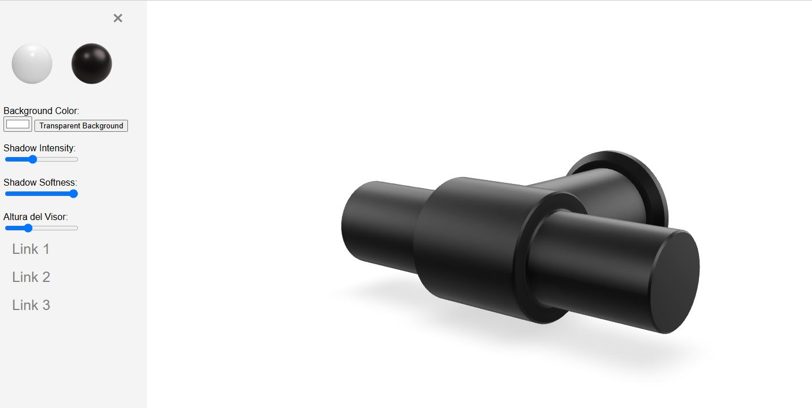

## Visor de producto

**Ejemplo de Visor de Modelos** es una aplicación web que permite a los usuarios interactuar con modelos 3D utilizando controles dinámicos. Cuenta con una barra lateral responsiva para la selección de modelos, personalización del fondo, ajustes de sombras y más, proporcionando una experiencia personalizable e inmersiva.

## Características

- **Visualización de Modelos 3D**: Muestra modelos 3D utilizando el componente web \`<model-viewer>\`.
- **Selección de Modelos**: Elige entre diferentes modelos (por ejemplo, Blanco y Negro) con simples clics.
- **Personalización del Fondo**: Cambia el color de fondo o configúralo como transparente.
- **Controles de Sombra**: Ajusta la intensidad y suavidad de las sombras para mejorar la apariencia visual.
- **Barra Lateral Responsiva**: Alterna una barra lateral que contiene todos los controles para una interfaz simplificada.
- **Ajuste de Altura del Visor de Modelos**: Ajusta dinámicamente la altura del visor de modelos para adaptarse a diferentes diseños.

## Demostración

## Acceso Rápido a la Aplicación
[Visor de producto](https://xococode.github.io/Xocoproduct.github.io/)

## Instalación

1. **Clona el repositorio:**

   \`\`\`bash
   git clone https://github.com/tuusuario/ejemplo-visor-modelos.git
   \`\`\`

2. **Navega al directorio del proyecto:**

   \`\`\`bash
   cd ejemplo-visor-modelos
   \`\`\`

3. **Abre el archivo \`index.html\` en tu navegador web preferido:**

   - Puedes hacer doble clic en el archivo \`index.html\`.
   - O, utiliza una extensión de servidor en vivo en tu editor de código para un mejor rendimiento.

## Uso

Una vez que la aplicación esté abierta en tu navegador:

1. **Alternar Barra Lateral**: Haz clic en el icono ☰ en la parte superior izquierda para abrir la barra lateral que contiene los controles.

2. **Seleccionar Modelo**:
   - Haz clic en las imágenes de "Modelo Blanco" o "Modelo Negro" para cambiar entre diferentes modelos 3D.

3. **Personalizar Fondo**:
   - Utiliza el selector de color para cambiar el color de fondo.
   - Haz clic en el botón "Fondo Transparente" para hacer el fondo transparente.

4. **Ajustar Sombras**:
   - Usa los deslizadores para modificar la intensidad y suavidad de las sombras.

5. **Cambiar la Altura del Visor de Modelos**:
   - Utiliza el deslizador de altura para ajustar la altura del visor de modelos según tu preferencia.

6. **Navegar Enlaces**:
   - La barra lateral contiene enlaces adicionales para una navegación más profunda (actualmente enlaces de marcador de posición).

## Tecnologías

- **HTML5**: Estructura de la aplicación.
- **CSS3**: Estilos y diseño responsivo.
- **JavaScript**: Interactividad y controles dinámicos.
- **[model-viewer](https://modelviewer.dev/)**: Componente web para renderizar modelos 3D.

## Contribuciones

¡Las contribuciones son bienvenidas! Por favor, sigue estos pasos:

1. **Haz un fork del repositorio.**

2. **Crea una nueva rama:**

   \`\`\`bash
   git checkout -b feature/TuCaracterística
   \`\`\`

3. **Realiza tus cambios y haz commit:**

   \`\`\`bash
   git commit -m "Añadir Tu Característica"
   \`\`\`

4. **Empuja la rama al repositorio remoto:**

   \`\`\`bash
   git push origin feature/TuCaracterística
   \`\`\`

5. **Abre una Pull Request.**

## Licencia

Este proyecto está licenciado bajo la [Licencia MIT](LICENSE).

---

*Siéntete libre de personalizar este README para que se ajuste mejor a las necesidades específicas de tu proyecto.*
`;

            const blob = new Blob([markdownContent], { type: 'text/markdown' });
            const url = URL.createObjectURL(blob);
            const a = document.createElement('a');
            a.href = url;
            a.download = 'README.md';
            document.body.appendChild(a);
            a.click();
            document.body.removeChild(a);
            URL.revokeObjectURL(url);
        });
    </script>
</body>
</html>
